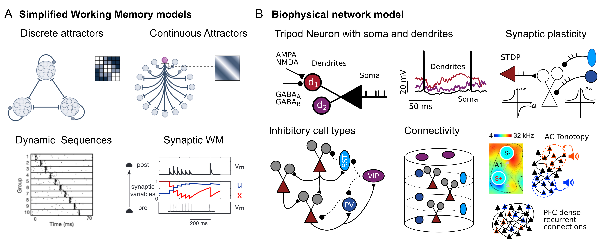
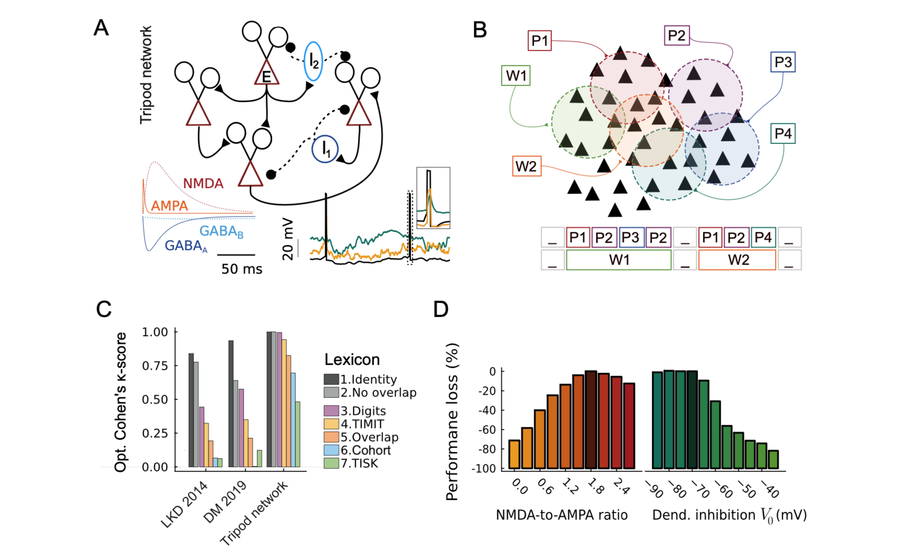

Title: Research Projects 
Date: 2020-01-01
Modified: 2023-12-23
page_order: 1
save_as: index.html
URL:..

My research focuses on unraveling the physiological basis of auditory perception and spoken language comprehension. My goal is to offer mechanistic insights into the neuronal computation supporting the early phases of speech perception, leveraging detailed biophysical models.

I believe that computational research is well suited for researchers with limited access to experimental facilities. Please contact me if you are interested in collaborating on one of the following projects:

## Neuronal and Network Mechanisms of Auditory Working Memory
Computational and experimental studies indicate that auditory working memory lies in the coordination of cortical network dynamics and single-cell physiological properties. However, how these mechanisms for memory interact during the encoding, maintaining, and retrieving of cued memories remains largely unknown.
The project, supported by the Pasteur-Roux-Cantarini fellowship, aims to establish the role of cellular- and network-level processes in maintaining short-term memories. The investigation is carried out by studying [biophysical network models](https://juliasnn.github.io/SpikingNeuralNetworks.jl) and comparing it with [calcium and voltage imaging recordings](https://doi.org/10.1016/j.neuron.2019.09.043).

Figure 1: (A) Four simplified WM models will be compared during the project. (B) The set of biological constraints of cortical circuitry which implemented in the biophysical network.

## Spectrotemporal Transformations in the Auditory Cortex
In mice, the auditory cortex is necessary to process complex sound patterns and transform subcortical temporal codes into flexible [cortical population codes](https://www.science.org/doi/10.1126/sciadv.adr6214). The challenge for the auditory cortex is to integrate information over time to activate the correct neuronal representations. Previous work has shown [the network properties that support this computation](https://elifesciences.org/articles/53151).

I address this question by probing thousands of network models with a high-throughput approach to parameter optimization. Networks are composed of 2500 excitatory and inhibitory cells, comprising fast-spiking and adapting interneurons, endowed with short/long-term synaptic plasticity. Excitatory and fast-spiking neurons receive real spike-trains recorded in mice's thalamus during passive listening of 88 distinct sounds. We compare networks with random, tonotopically organized, and purely feed-forward connections. For each arrangement, excitatory neurons feature either point neurons or three-compartment models with dendritic nonlinearity. Evidence-based objective functions guide the optimization of parameters; maximizing sound discrimination, minimizing the cross-entropy between the model's firing rates and AC recordings, and enforcing the spiking asynchronous-irregular regime.

Figure 1: (A) Tonotopic structure of thalamic afferents; (B) Spatial recurrent connectivity; (C) Example of sound presentation and network activity; (D) Model comparison and task accuracy; (E) Model and AC representation similarity. Optimal parameters for short term plasticity (F) and recurrent weights (G).

## Performant Spiking Neural Network Simulator in Julia
[JuliaSNN](https://juliasnn.github.io/SpikingNeuralNetworks.jl) is a library for simulation of biophysical network models. The library offers:
i. Modular, flexible, and quick instantiation of complex biophysical models;
ii. Rich model library and easy implementation of custom new models;
iii. High performance and native multi-threading support, laptop and cluster-friendly;
iv. Easy access to models' variables and parameters and save-load-rerun of arbitrarily complex networks.
SpikingNeuralNetworks.jl is defined within the JuliaSNN ecosystem, which offers SNNPlots to plot models' recordings and SNNUtils for further stimulation protocols and analysis.

## Dendritic Integration and Hetero-Associative Memories
In a recent work, we showed the capacity of biological networks to detect sequences of brief, transitory stimuli thanks to cellular properties ([Dendrites support formation and reactivation of sequential memories through Hebbian plasticity 2023](https://www.biorxiv.org/content/10.1101/2023.09.26.559322v2.full.pdf+html)). The computational study demonstrates the formation of hetero-associative memories, in the form of asymmetric synaptic engrams, between low-level and high-level cell assemblies. The synaptic structure is necessary and sufficient for the word assemblies to activate upon the presentation of the correct sequence of low-level features.

Figure 1: (A) Tripod network with its connectivity patterns, receptor timescales, and membrane dynamics. (B) Word and phonemes target overlapping assemblies. (C) Word-recognition score of networks with point neurons and Tripod neurons. (D) Performance loss after modulation of dendritic non-linearity and iSTDP.

## Dendrites Support Temporal Computations and Account for Physiological States
My Ph.D. research focused on the dynamics of neuronal models that include reduced dendritic compartments.
We have shown that such models:   
i. [Have richer computational capacities](https://physoc.onlinelibrary.wiley.com/doi/full/10.1113/JP283399), among which the ability to carry a trace of the inputs' temporal structure over hundreds of milliseconds. 
ii. Exhibit membrane bistability in response to small fluctuations in the input, coordinating [network and cellular levels Up-Down states](https://www.biorxiv.org/content/10.1101/2024.09.05.611249v3)