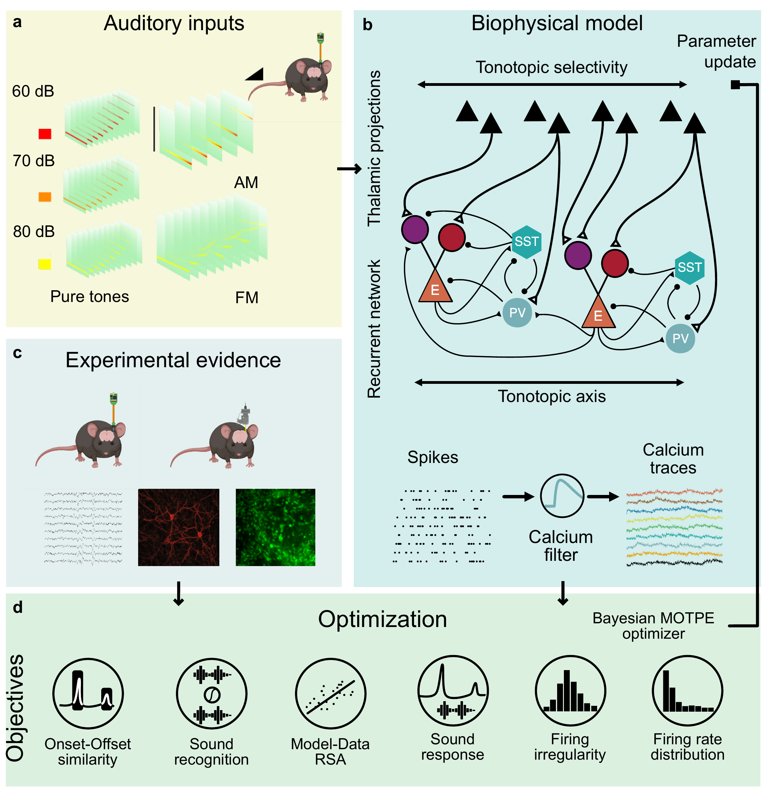
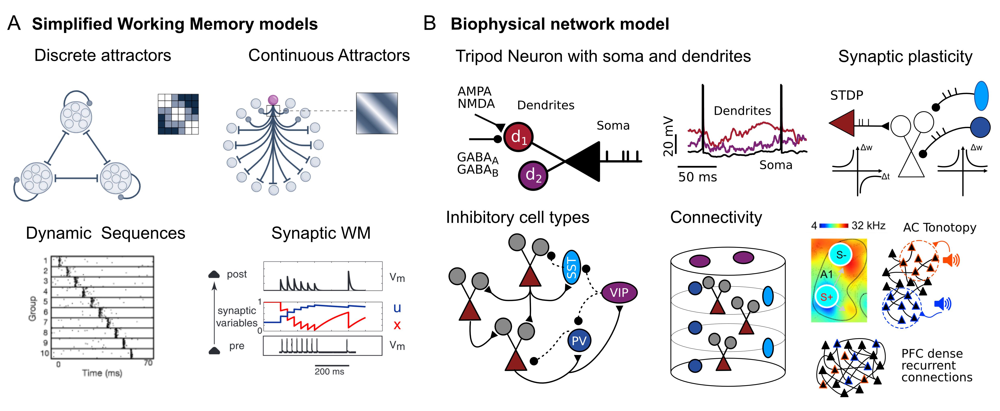

Title: Research Projects
Date: 2020-01-01
Modified: 2026-09-29
page_order: 1
save_as: index.html
URL:..

My research develops biophysically grounded models of cortical circuits to understand how neurons and networks implement computation. The work spans three interconnected themes: dendritic integration and nonlinear single-cell dynamics, synaptic plasticity and memory formation, and the functional specialization of cortical cell types, with a particular focus on the auditory cortex and spoken language.

All projects rely on close interaction with experimental data, and I actively seek collaborations with groups doing electrophysiology, calcium imaging, or optogenetics. Please get in touch if you are interested in working together.

---

## Spectrotemporal Transformations in the Auditory Cortex

In mice, the auditory cortex is necessary to process complex sounds, turning subcortical temporal codes into flexible [cortical population codes](https://www.science.org/doi/10.1126/sciadv.adr6214). Its challenge is to integrate information over time to activate the right representations. [Previous work](https://elifesciences.org/articles/53151) has identified network properties that support this computation. Sound identity is also accessible during offset responses, pronounced bursts of population activity following sound termination. However, the biophysical mechanisms supporting offset responses remain unclear.

I investigated them by constraining biophysical spiking networks of pyramidal, PV, and SST cells to the functions and statistics of the auditory cortex at the same time. The networks receive spike trains recorded in the mouse thalamus (medial geniculate body, MGB) during passive listening to 88 sounds, and a multi-objective optimizer (MOTPE) tunes 37 parameters against six objectives. No solution wins on all of them: the solutions spread along a Pareto front, which I segmented into three regimes. The main trade-off is between decoding capacity and stable, low-firing representations. Strong, adapting thalamic input in feedforward-dominated networks yields the most information-rich offset response, whereas recurrent connectivity is necessary to integrate this information into time-stable representations. I hypothesize that cellular and synaptic heterogeneity allows the auditory cortex to reconcile these two requirements.

<strong>Figure 1:</strong> (a) Auditory inputs: pure tones at 60, 70, and 80 dB, and amplitude-modulated (AM) and frequency-modulated (FM) sounds. (b) Biophysical network with tonotopic thalamic projections and recurrent connectivity among pyramidal cells, PV and SST interneurons; spikes are convolved with a calcium filter for comparison with imaging data. (c) Electrophysiology and calcium imaging recordings provide the experimental constraints. (d) A Bayesian MOTPE optimizer updates the parameters to satisfy six objectives: onset-offset similarity, sound recognition, model-data representational similarity, sound response, firing irregularity, and firing-rate distribution.

---

## Neuronal and Network Mechanisms of Auditory Working Memory

Computational and experimental studies indicate that auditory working memory (WM) depends on the coordination of cortical network dynamics and single-cell physiological properties. However, how these mechanisms interact during the encoding, maintenance, and retrieval of cued memories remains largely unknown.

The project, supported by the Pasteur-Roux-Cantarini fellowship, aims to establish the role of cellular- and network-level processes in maintaining short-term memories. It combines [biophysical network models](https://juliasnn.github.io/SpikingNeuralNetworks.jl) with [calcium and voltage imaging recordings](https://doi.org/10.1016/j.neuron.2019.09.043).

Figure 2: (A) Four simplified WM models to be compared during the project. (B) Biological constraints of cortical circuitry implemented in the biophysical network.

---

## Performant Spiking Neural Network Simulator in Julia

[JuliaSNN](https://juliasnn.github.io/SpikingNeuralNetworks.jl) is a library for simulating biophysical network models. It offers:

- quick, modular, and flexible setup of complex biophysical models;
- a rich model library and easy implementation of custom models;
- high performance and native multi-threading, on laptops and clusters alike;
- easy access to model variables and parameters, and saving, loading, and rerunning of arbitrarily complex networks.

SpikingNeuralNetworks.jl is part of the JuliaSNN ecosystem, which also offers SNNPlots to plot model recordings and SNNUtils for stimulation protocols and analysis.

---

## Dendritic Integration and Hetero-Associative Memories

In recent work, we showed that biological networks can detect sequences of brief, transient stimuli thanks to dendritic properties ([Dendrites support formation and reactivation of sequential memories through Hebbian plasticity](https://www.biorxiv.org/content/10.1101/2023.09.26.559322v2.full.pdf+html), 2023). The model forms hetero-associative memories, as asymmetric synaptic engrams linking low-level and high-level cell assemblies. This synaptic structure is necessary and sufficient for word assemblies to activate when the correct sequence of low-level features is presented.

Figure 3: (A) Tripod network with its connectivity patterns, receptor timescales, and membrane dynamics. (B) Words and phonemes target overlapping assemblies. (C) Word-recognition score of networks with point neurons and Tripod neurons. (D) Performance loss after modulation of dendritic nonlinearity and inhibitory STDP (iSTDP).

---

## Dendrites Support Temporal Computations and Account for Physiological States

My PhD research focused on the dynamics of neuronal models that include reduced dendritic compartments. We have shown that such models:

- have [richer computational capacities](https://physoc.onlinelibrary.wiley.com/doi/full/10.1113/JP283399), including the ability to carry a trace of the inputs' temporal structure over hundreds of milliseconds;
- exhibit membrane bistability in response to small input fluctuations, coordinating [Up-Down states across cellular and network levels](https://www.biorxiv.org/content/10.1101/2024.09.05.611249v3).

